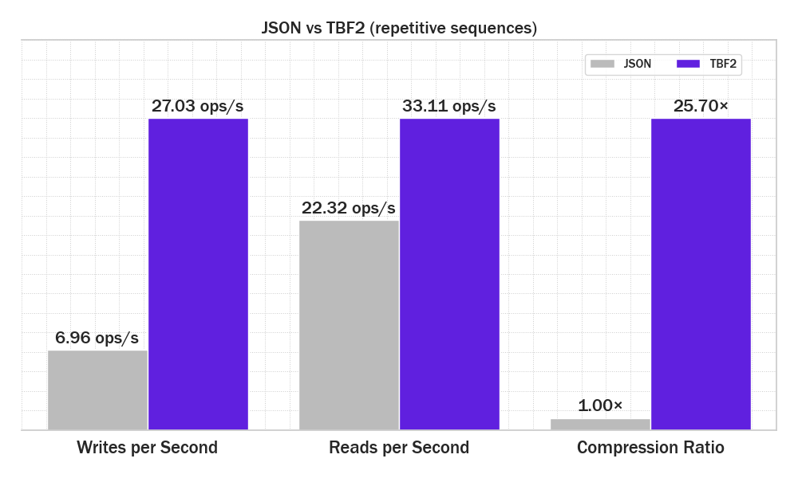
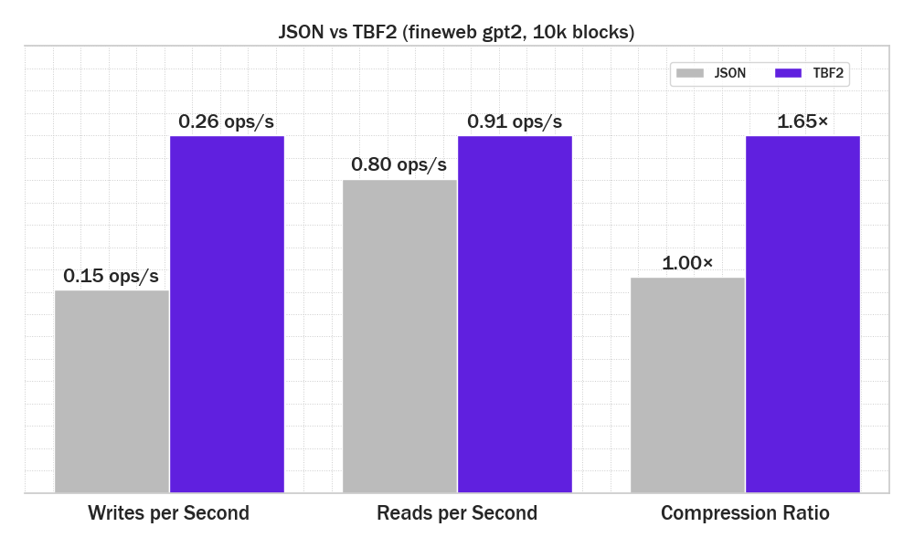

# Token Block Format 2 (TBF2) 🚀




[](https://opensource.org/licenses/MIT)
[](https://www.python.org/downloads/)
[](https://github.com/quantius/tbf2)

**The fastest, most space-efficient way to store ML token sequences.** TBF2 delivers up to 10x compression ratios and blazing-fast I/O performance for your machine learning pipelines.

## Why TBF2?

Traditional token storage methods waste space and time. TBF2 changes the game:

- **🎯 Precision-Optimized**: Choose from 1-bit to 64-bit encodings - why use 32 bits when 12 will do?
- **🗜️ Intelligent Compression**: Built-in zlib, bz2, lzma + extensible custom compression
- **⚡ Lightning Fast**: NumPy-accelerated encoding/decoding with streaming I/O
- **🔧 Production Ready**: Robust validation, integrity checking, and memory-efficient processing

Perfect for transformer training data, tokenized datasets, and any application where token sequences need efficient storage.

## Installation

TBF2 is a single-file Python module. Just download it into your working directory and import it.

### 💻 Windows (PowerShell)
```bash
wget "https://raw.githubusercontent.com/quantius-ai/tbf2/refs/heads/main/tbf2.py" -OutFile "tbf2.py"
```

### 🐧 Linux / 🍎 macOS
```bash
wget -O tbf2.py "https://raw.githubusercontent.com/quantius-ai/tbf2/refs/heads/main/tbf2.py"
```

## Quick Start

> 📖 *Looking for detailed docs? [Read the Full Documentation →](/docs/DOCS.md)*

### The Simple Way

```python
from tbf2 import write_tbf2, read_tbf2

# Your token data
data = [
    [1, 2, 3, 4, 5],
    [10, 20, 30],
    [100, 200, 300, 400]
]

# Write with intelligent defaults
write_tbf2("tokens.tbf2", data)

# Read back instantly
tokens = read_tbf2("tokens.tbf2")
```

### The Power-User Way

```python
from tbf2 import TBF2Writer, TBF2Reader

# Fine-grained control for maximum efficiency
with TBF2Writer(
    "optimized.tbf2",
    token_mode="12bit",      # Precise bit-width
    compression="zlib",       # Smart compression
    compression_level=6,      # Balanced performance
    signed=False             # Unsigned optimization
) as writer:
    for chunk in data:
        writer.write(chunk)

# Stream large files without memory overhead
with TBF2Reader("optimized.tbf2") as reader:
    for chunk in reader:
        process_chunk(chunk)
```

## Performance Benchmarks

Repetitive 16-grams, random 128-256 block size


FineWeb GPT2 tokenized, max ctx len 1024

*Benchmarks run on: Intel Core Utlra 7 155H, 32GB RAM, NVMe SSD. More details available*

## Compression Options

Choose your trade-off between speed and space:

```python
# Maximum speed (no compression)
write_tbf2("fast.tbf2", data, compression="none")

# Balanced performance (recommended)
write_tbf2("balanced.tbf2", data, compression="zlib", compression_level=6)

# Maximum compression
write_tbf2("smallest.tbf2", data, compression="lzma", compression_level=9)
```

## Advanced Features

### Variable-Width Encoding
```python
# Handles extreme token ranges efficiently
mixed_tokens = [1, 1000000, 5, 2000000000]

with TBF2Writer("variable.tbf2", token_mode="anybit") as writer:
    writer.write(mixed_tokens)
```

### Signed Integer Support
```python
# Full signed integer support with ZigZag encoding
with TBF2Writer("signed.tbf2", token_mode="16bit", signed=True) as writer:
    writer.write([-1000, 0, 1000])
```

### Custom Compression
```python
from tbf2 import register_compression

# Extend with your own compression algorithms
def custom_compress(data: bytes, level: int) -> bytes:
    return your_compression_algorithm(data, level)

def custom_decompress(data: bytes) -> bytes:
    return your_decompression_algorithm(data)

register_compression("custom", custom_compress, custom_decompress)
```

## Token Mode Reference

| Mode | Range | Use Case |
|------|-------|----------|
| **1bit** | 0-1 | Binary flags, boolean sequences |
| **4bit** | 0-15 | Small vocabularies, nibble data |
| **8bit** | 0-255 | Byte-aligned data, small tokens |
| **12bit** | 0-4,095 | Moderate vocabularies |
| **16bit** | 0-65,535 | Standard token ranges |
| **24bit** | 0-16M | Large vocabularies (GPT-style) |
| **32bit** | 0-4.2B | Very large vocabularies |
| **anybit** | Unlimited | Mixed or extreme ranges |

*Signed variants available for all modes*

## File Format Deep Dive

```
┌─────────────────────────────────────────────────────────────┐
│                    TBF2 File Structure                      │
├─────────────────────────────────────────────────────────────┤
│ Header (32 bytes)                                           │
│ ├─ Token Mode (1 byte)                                      │
│ ├─ Compression Info (8 bytes)                               │
│ ├─ Chunk Count (8 bytes)                                    │
│ └─ Max Tokens Per Chunk (4 bytes)                           │
├─────────────────────────────────────────────────────────────┤
│ Chunk 1                                                     │
│ ├─ Token Count (4 bytes)                                    │
│ ├─ Compressed Size (4 bytes, if compressed)                 │
│ └─ Token Payload (variable)                                 │
├─────────────────────────────────────────────────────────────┤
│ Chunk 2...                                                  │
└─────────────────────────────────────────────────────────────┘
```

## Real-World Applications

- **🤖 ML Training Pipelines**: Store tokenized datasets efficiently
- **📚 Large Language Models**: Compact token sequence storage
- **🔤 NLP Preprocessing**: Intermediate tokenization results
- **📊 Time Series Data**: Integer sequence compression
- **🎮 Gaming**: Efficient save file formats

## API Reference

### Core Functions
- `write_tbf2()` - High-level file writing
- `read_tbf2()` - High-level file reading
- `get_tbf2_info()` - File metadata inspection
- `is_valid_payload()` - Data validation

### Advanced Classes
- `TBF2Writer` - Streaming writer with fine-grained control
- `TBF2Reader` - Memory-efficient streaming reader

### Compression Management
- `register_compression()` - Add custom compression algorithms
- `get_compression()` - Retrieve compression codecs
- `remove_compression()` - Unregister custom codecs

## Performance Tips

1. **🚀 Use NumPy**: Install NumPy for 3-5x performance boost
2. **🎯 Right-size bit-width**: Smaller = faster + more compact
3. **📦 Batch intelligently**: Larger chunks compress better
4. **⚖️ Balance compression**: Level 6 is the sweet spot for most use cases

## Contributing

We welcome contributions! Whether it's performance improvements, new compression algorithms, or better documentation - every contribution makes TBF2 better for everyone.

## License

MIT License - see LICENSE file for details.

## Authors

Created by the team at **Quantius LLC**:
- Darin Tanner
- Elijah Tribhuwan  
- Sharad Sreekanth

---

*Ready to supercharge your token storage? Give TBF2 a try and experience the difference.*


**[⭐ Star this repo](https://github.com/quantius/tbf2) if TBF2 helps your project!**
